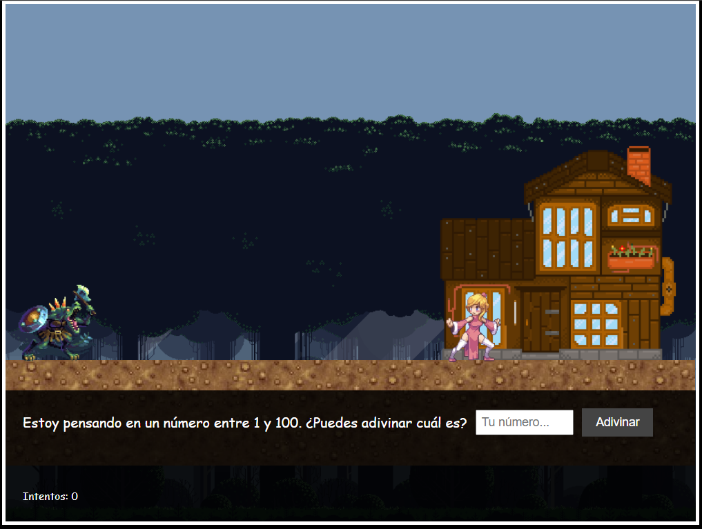

# 🎮 RPG Number Guess Game (16-bit Style)

Welcome to the classic RPG-style guessing mini-game!

## 🧩 Description

This is a small interactive game where you must guess a number between 1 and 100. You have a limited number of attempts before a monster reaches you. The game features a 16-bit visual style, retro music, animations, and lurking enemies.

## 🕹️ How to Play

- Enter a number between 1 and 100 and click "Guess".
- If the number is too low or too high, you'll be notified.
- Each attempt brings the monster closer.
- If you guess the number before the monster reaches you and in fewer than 7 turns, you enter the house and win!
- If you fail, the monster gets you... 😱

## 🎨 Features

- 16-bit RPG visual aesthetics.
- Royalty-free suspense background music.
- Character animation when entering the house.
- Custom pop-up messages.
- Clean and modular code in HTML, CSS, and JavaScript.

## 🔧 Technologies Used

- HTML5  
- CSS3  
- JavaScript (vanilla)  
- Git + GitHub  

## 📷 Screenshot

  

## 🚀 How to Run

Open `index.html` in your browser.  
Ready to play!

## 📜 License

This project is for personal and educational use. Feel free to use it as inspiration or as a base for your own projects.

## 🧙‍♂️ Good luck, hero! Guess before the monster catches you...
